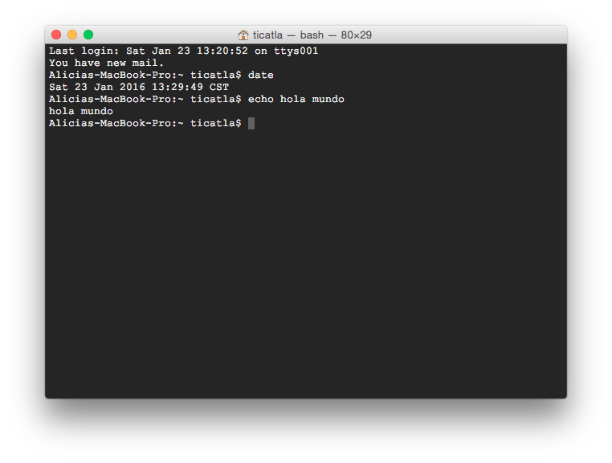

# Introducción a bash y docker para manejo de datos genómicos

## Introducción a la Terminal

El "shell" es un programa que toma **comandos** a través del teclado y se los pasa al sistema operativo para que los realice.  

La Terminal es un programa que abre una ventana y que nos deja interactuar con el shell. 

Esta Terminal sólo existe en sistemas Mac o Linux.

Si tienes Linux o Mac en tu terminal verás algo así:

La primera línea dice la fecha y hora y "ttys001". ttys viene de "Teletype" ([un poco de historia aquí](http://stackoverflow.com/questions/4532413/what-is-tty-on-freebsd)) y significa que el *input* es nuestro teclado, identificado como ttys001. 

En mi caso la segunda línea me dice que tengo correo. Uds probablemente no tengan esto.

La tercera línea es la más importante: dice el **nombre del equipo** (Aliicas-MacBook-Pro en este caso), el **directorio** donde estoy (`~` significa "home directory", lo veremos más adelante) y el **nombre del usuario** con quién estoy en la terminal (en mi caso ticatla). 

Notarás que la tercera línea termina en `$`

`$` significa que la terminal está corriendo con un interpretador Shell o Bash y por un usuario sin mayores privilegios. Si termina en `#` significa que la estás corriendo como **root** que es un "súper usuario" con permisos para desconfigurarlo todo, ten cuidado. 

El la Terminal no existe el *point and click*. El que funcione como una Línea de Comando significa que tienes que darle comandos de qué hacer línea por línea. 

Por ejemplo:

`date` nos responde la fecha actual

`echo algo` nos responde el texto "algo". También lo puedes utilizar con más de una palabra. 

Algo así debe verse tu terminal:

 
Para facilidad visual, de aquí en adelante utilizaremos la opción con el texto a partir de `$` (al menos que sea pertinente ver lo que hay antes). Este tipo de formato te lo encontrarás en diversos foros de ayuda, libros de textos y manuales.
 

**Pregunta**: ¿Qué pasa si intentas correr el comando  `algo`?:

La terminal dirá:

    -bash: algo: command not found

Que quiere decir que no existe el comando `algo`. 

Los comandos que podemos pasarle a una terminal de shell corresponden a un lenguaje de programación específico, llamado **_bash_**.

Muchos de uds traen Windows y en ese OS la Terminal no existe, por ende utilizaremos este excelente curso de [Code Academy Learn the command line](https://www.codecademy.com/courses/learn-the-command-line/lessons/navigation/exercises/your-first-command?action=lesson_resume) para aprender nuestros primeros comandos de bash. Además de ese curso, en [estas notas de bash](2_bash.md) resumí los principales comandos que se utilizan rutinariamente en bioinformática. Necesitarás leerlos con atención para resolver la tarea.

Posteriormente, para que todos podamos tener nuestra propia terminal y realizar análisis instalaremos [docker](3_docker.md), que es una herramienta muy poderosa que nos permite tener una terminal dentro de nuestra PC sin necesidad de instalar otro sistema operativo. 


