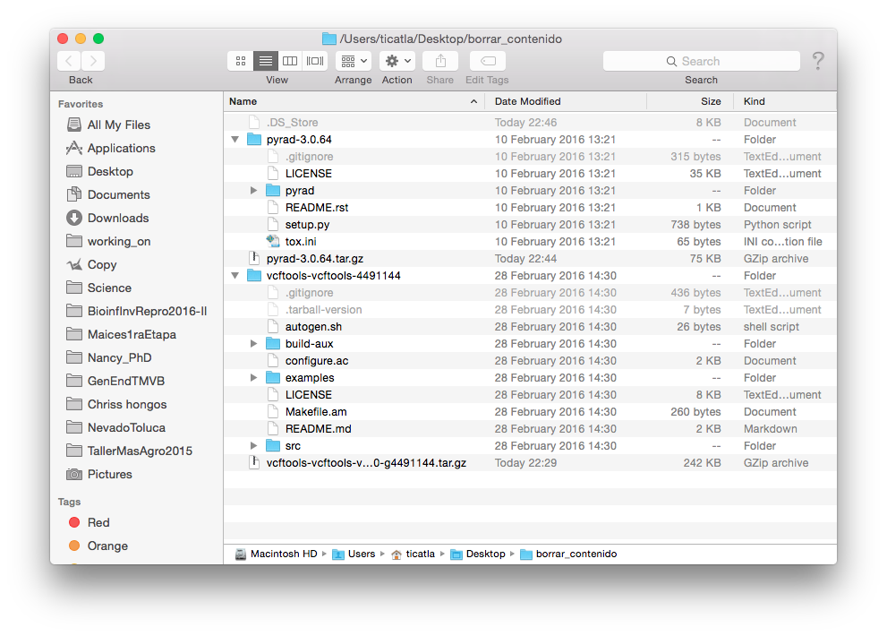

# Uso general de software especializado

## Utilidad de software especializado 		

El software especializado permite realizar operaciones complejas con datos genéticos y preguntas biológicas de un tipo particular. 

Por ejemplo el ensamblado *de novo* de datos de GBS/RAD, puede hacerse con diferente software dependiendo de si las preguntas biológicas están enfocadas en genética de poblaciones (Stacks), filogenética (pyRAD) o diversidad de cultivos (UNEAK-TASSEL). 


## Cómo entender la instalación y documentación de software especializado

### Instalación 
El software especializado en bioinformática en su mayoría corre directamente desde la línea de comando en Linux o Mac y está escrito en lenguajes como C++, python y Perl, entre otros. Por ende, su instalación no es dar dos clicks, sino realizar una serie de pasos, en su mayoría involucrando los siguientes:

1) Busca la versión más reciente del software especializado de tu interés. Por lo general tienen su propia página en algún rincón del internet.

Veamos dos ejemplos:

[VCFtools](http://vcftools.github.io/index.html)
[pyRAD](http://dereneaton.com/software/pyrad/)

2) Busca la sección de **Download**, o **Install**. Normalmente te llevarán a bajar un tar o a un comando para bajar el tar desde Github. 

**Ojo**: si hay una sección que diga "Computing Requirements" o "Specs" checa eso primero. E.g: para [Trinity](https://github.com/trinityrnaseq/trinityrnaseq/wiki/Trinity-Computing-Requirements).

3). Baja el **source code** del programa.

Si vemos el contenido de los tar que bajamos veremos algo así:



4. Por lo general el tar con el source code incluye un archivo de texto (o Markdown) llamado **README**, pero también puede llamarse **INSTALL**. Este es el primer archivo que siempre debemos consultar (y si tanto README como INSTALL existen, primero README).

Así se ve el de pyRAD:


Y así el de VCFtools:


5. La instalación consiste en seguir los pasos que nos dice el README (o el link que contenga el README, a veces pasa).

**Puntos a observar**: 

* La instalación varía de programa a programa
* La instalación puede requerir los comandos:
  - `sudo`
  - `./configure`
  - `make`
  - `make install`
* Nuestro software de interés puede requerir **dependencias**, es decir otros programas o librerías (de python, Perl, etc) para poder correr. 
* Algunas de esos otros programas pueden instalarse a través de programas para instalar cosas, como `pip`, `brew`, etc. 

#### ¿Qué hacen `sudo`, `./configure`, `make` y `make install`?

Bonita referencia [aquí](https://robots.thoughtbot.com/the-magic-behind-configure-make-make-install)

#####`sudo`: 

Te vuelve el *super usuario*, es decir eres un todo poderoso administrador que puede hacer lo que sea con la línea de comando sin que la computadora te diga que no.

xkcd lo explica así: 


Debemos usar `sudo` ya que al correr como usuarios normales no tenemos privilegios de administrador, lo cual es una medida de seguridad para que no corran programas que se metan con nuestro sistema sin nuestra autorización, y también para revisar que sabes lo que haces antes de modificar algo importante en el sistema. 


##### `./configure`:

Para correr esto primero **debes** estar en el tar (descomprimido) del programa que acabas de bajar. La razón es que esta línea de comando corre un script llamado `configure` (que es un ejecutable) que **viene con tu programa**. 

Un script `configure` básicamente revisa que la computadora donde vas a instalar el programa tenga las dependencias que el programa necesita. En ocasiones puede decirte que no las tiene, pero que amablemente las baja por ti. En tal caso te lo preguntará, con al final de la pregunta un paréntesis así `(Y/n)`, tienes que decirle si Yes or Not. 

Si algunos de los requisitos importantes no se puede conseguir `configure` marcará error y no podrás continuar con la instalación hasta que tengas esas dependencias en orden (o sea que las instales por ti misma). Este suele ser el paso más doloroso de instalaciones difíciles.

Si todo sale bien configure habrá **creado** un nuevo archivo en nuestro WD (que sigue siendo el descomprimido del tar del programa en cuestión) llamado **MakeFile**, puedes pasar al siguiente paso:

##### `make`:

`make` es un programa de Unix que corre un archivo `MakeFile` que se encuentre en el WD. Este archivo (que creamos con `configure` en el paso anterior) es ligeramente diferente dependiendo de cada computadora, es decir, está personalizado para tu computadora, por eso no viene en el tar que bajamos. 

El `MakeFile` indica la secuencia de comandos que se necesitan seguir para construir (*build*) los componentes o sub-programas del software y crea los ejecutables necesarios. A esto también se le conoce como *compilación*.

Si todo sale bien, puedes seguir al último paso:

##### `make install`: 

`make install` también corre el archivo `MakeFile`, pero sólo una sección dentro de dicho archivo llamada **Install**. Esta sección contiene instrucciones para que los archivos creados por el paso anterior (`make`) se copien a sus directorios destino dentro de tu computadora, por ejemplo `/usr/local/bin` para que cualquier usuario los pueda correr. Si fue necesario instalar dependencias, estas también se copiarán al lugar que les corresponda (se crearon en el paso anterior, pero vivían en un directorio temporal). 

Muy probablemente en este paso tu terminal te dirá que no tienes autorización (`Permission denied`) si intentas correr `make install`. Aquí es cuando entra `sudo`, así:

`sudo make install`

(Te pedirá tu pasword, dáselo). 

### Utilidad de Docker 
Como vimos antes, Docker se puede utilizar para instalar software especializado en un contenedor, lo que nos evita problemas de compatibilidad entre librerías y otros pre-requisitos. 

Ademas, en BioContainers puede ya existir una imagen del software deseado.

Por ejemplo, para instalar VCFtools y entrar a un contenedor:

```
$ docker pull biocontainers/vcftools:0.1.14
$ docker run -it biocontainers/vcftools:0.1.14 bash
```


### Documentación 

La **documentación** de un programa bioinformático (y de cualquier software) se refiere al **manual** y tutoriales asociados al programa. 

Dos maneras de encontrar el manual:

* Dentro del programa (e.g. `man vcftools` o `vcftools -help`)
* En internet (en la página del software).

La complejidad del manual depende de la complejidad de la herramienta en sí. Si es algo que involucre varios pasos y analizar (en vez de solo e.g. reformatear) datos lo más recomendable es dedicarle una tarde (o semana) entera a correr y entender paso por paso un tutorial. Otras cosas sencillas pueden entenderse dándole un vistazo al manual. 

Vamos a ver algunos ejemplos de manuales online:

* [VCFtools](https://vcftools.github.io/man_latest.html)
* [Stacks](http://catchenlab.life.illinois.edu/stacks/manual/)
* [Trinity](https://github.com/trinityrnaseq/trinityrnaseq/wiki/Running%20Trinity)


**Ejercicio:** 
a) En un contenedor donde tengas instalado vcftools utiliza un comando para bajar los datos en formato vcf del repositorio Schweizer RM, Robinson J, Harrigan R, Silva P, Galaverni M, Musiani M, Green RE, Novembre J, Wayne RK (2015) Data from: Targeted capture and resequencing of 1040 genes reveal environmentally driven functional variation in gray wolves. Dryad Digital Repository. [http://dx.doi.org/10.5061/dryad.8g0s3](http://datadryad.org/resource/doi:10.5061/dryad.8g0s3)

b) Cambia el nombre del archivo que acabas de bajar a `wolves.vcf`.

c) ¿Cuántos MB pesa el archivo?

d) ¿Cuántos individuos y variantes (SNPs) tiene el archivo?

e) Calcula la frecuencia de cada alelo para todos los individuos dentro del archivo y guarda el resultado en un archivo.

f) ¿Cuántos sitios del archiov no tienen missing data?

g) Calcula la frecuencia de cada alelo para todos los individuos pero solo para los sitios sin missing data y guarda el resultado en un archivo. 

h) ¿Cuántos sitios tienen una frecuencia del alelo menor <0.05?

i) Calcula la heterozygosidad de cada individuo.

j) Calcula la diversidad nucleotídica por sitio.

k) Calcula la diversidad nucleotídica por sitio solo para los sitios del cromosoma 3

l) Filtra los sitios que tengan una frecuencia del alelo menor  <0.05 y crea un archivo nuevo llamado `wolves_maf05.vcf`.

m) Convierte el archivo `wolves_maf05.vcf` a formato plink. 

 
